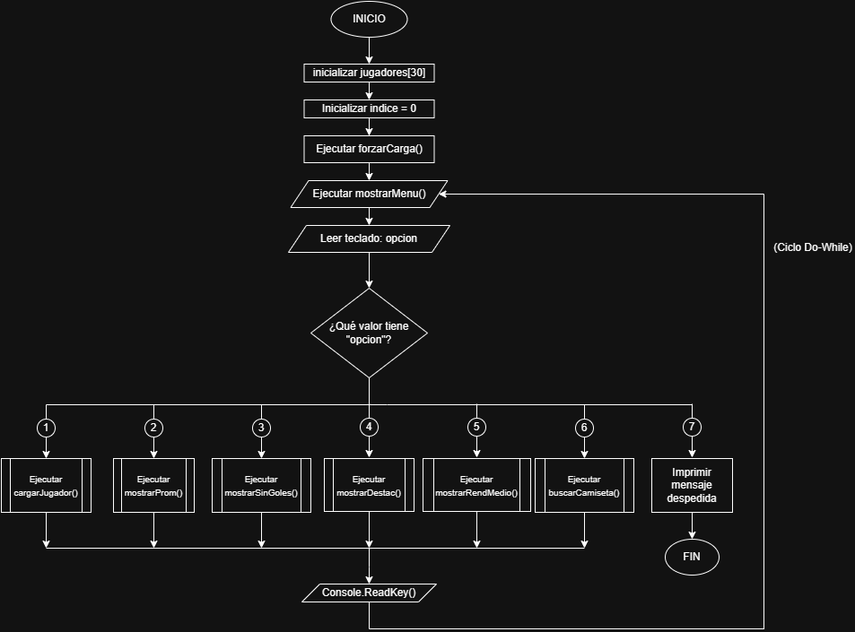
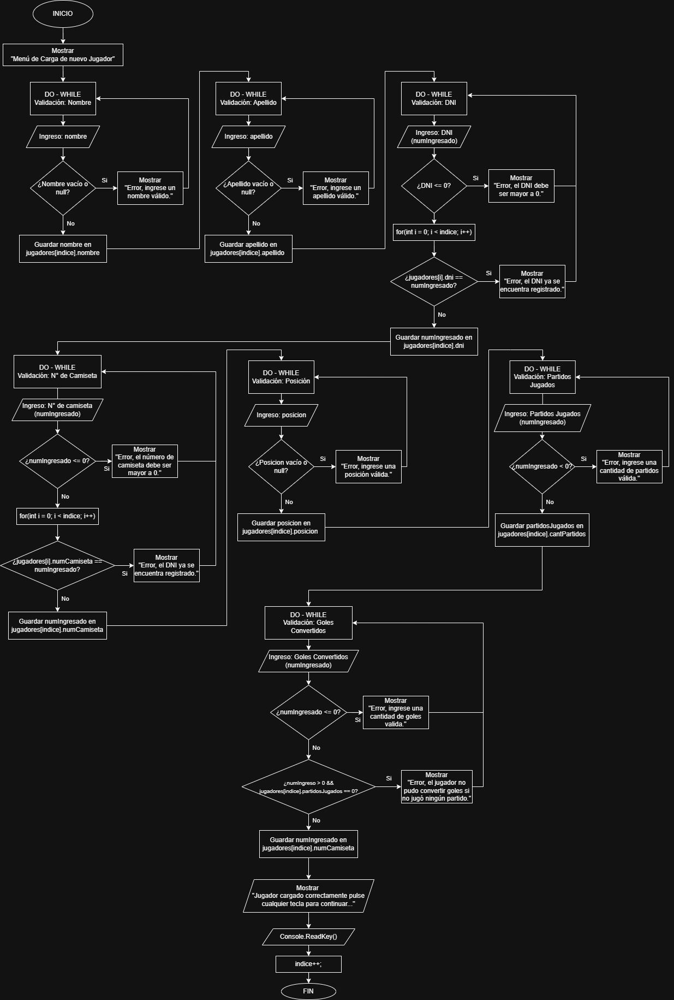
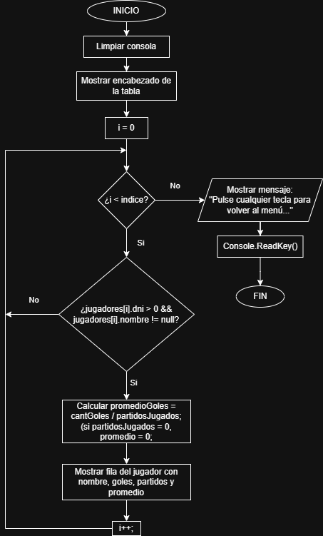
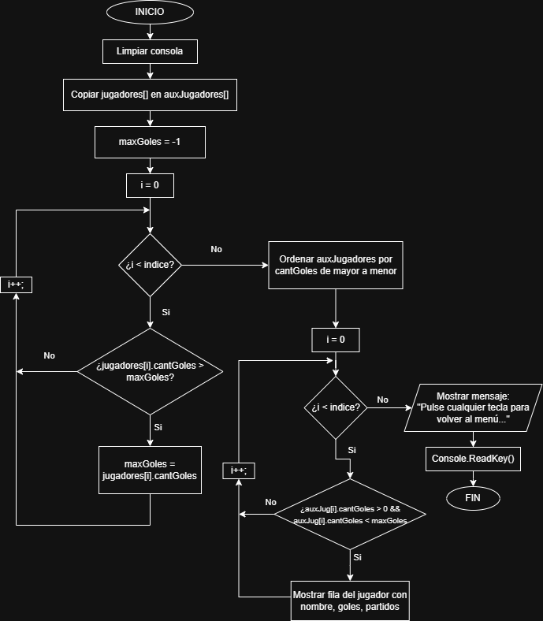
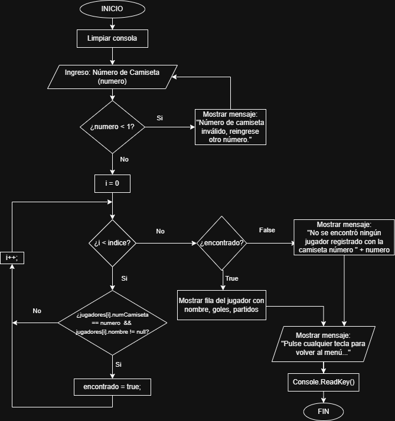

# Proyecto Final - Conceptos de Programación (UNAJ)

Proyecto final de la materia **Conceptos de Programación** correspondiente al **1° Cuatrimestre 2026** de la **Universidad Nacional Arturo Jauretche (UNAJ)**.

## 📋 Descripción

Este proyecto consiste en el desarrollo de una aplicación de consola en **C#** para la gestión de jugadores de un equipo deportivo.

El sistema permite almacenar la información de hasta **30 jugadores** y realizar distintas consultas y estadísticas sobre los datos registrados.

## ✨ Funcionalidades

- Alta de jugadores.
- Registro de:
  - Nombre y apellido.
  - DNI.
  - Número de camiseta.
  - Posición.
  - Cantidad de partidos jugados.
  - Cantidad de goles convertidos.
- Cálculo del promedio de goles por jugador.
- Listado de jugadores sin goles.
- Listado de jugadores destacados.
- Listado de jugadores con rendimiento medio.
- Búsqueda de un jugador por número de camiseta.
- Menú interactivo en consola.

## 🛠️ Tecnologías utilizadas

- C#
- .NET
- Visual Studio

## 📚 Conceptos aplicados

Durante el desarrollo del proyecto se utilizaron los contenidos vistos en la materia:

- Variables
- Estructuras de decisión (`if`, `switch`)
- Estructuras repetitivas (`for`, `while`)
- Arreglos
- Estructuras (`struct`)
- Funciones
- Modularización del código

## 📁 Estructura del proyecto

```
Proyecto_Final_C16_Cossa_Gonzalo_Agustin
│
├── Program.cs
├── Funciones.cs
├── Estructuras.cs
├── Ejecutor.cs
├── Properties/
└── Proyecto_Final_C16_Cossa_Gonzalo_Agustin.csproj
```
## 📐 Diagramas de Flujo del Proyecto

A continuación se detallan los diagramas de flujo que guían la lógica y el diseño de la aplicación:

### 1. Flujo General del Sistema (Menú Principal)
Controla la inicialización de los datos (incluyendo una precarga mediante `forzarCarga`), muestra el menú y deriva el flujo a la función correspondiente según la opción seleccionada.



### 2. Carga de Jugador y Validaciones
Detalla los bucles iterativos utilizados para asegurar que cada campo ingresado cumpla con las reglas de negocio antes de incrementar el índice de jugadores.



### 3. Mostrar Promedio de Goles
Recorrido secuencial del arreglo para calcular de forma segura y estructurada la efectividad goleadora.



### 4. Mostrar Jugadores Destacados
Doble pasada lógica: la primera para hallar la cantidad máxima de goles en el plantel, y la segunda para listar a todos los jugadores que ostentan dicha marca.

![Jugadores Destacados]./images/JugadoresDestacados.png)

### 5. Mostrar Jugadores con Rendimiento Medio
Uso de un arreglo auxiliar, algoritmo de ordenamiento y filtrado de estadísticas excluyendo el valor máximo absoluto.



### 6. Mostrar Jugadores sin Goles
Filtrado simple de la lista enfocado en aquellos elementos con valor cero en el registro de anotaciones.

![Sin Goles]./images/JugadoresSinGoles.png)

### 7. Buscar por Número de Camiseta
Búsqueda lineal indexada que valida el ingreso de un número correcto y avisa al usuario en caso de no hallar coincidencia.



## ▶️ Cómo ejecutar

1. Clonar el repositorio.

```bash
git clone https://github.com/GonzaloCossa/Proyecto-Final-C-Conceptos-de-Programaci-n-UNAJ.git
```

2. Abrir la solución en **Visual Studio**.

3. Ejecutar el proyecto (`F5` o `Ctrl + F5`).

## 👨‍🎓 Autor

**Gonzalo Agustín Cossa**

Proyecto realizado como trabajo final para la materia **Conceptos de Programación** - **Universidad Nacional Arturo Jauretche (UNAJ)**.

## 📄 Licencia

Este proyecto fue desarrollado con fines exclusivamente educativos y académicos.